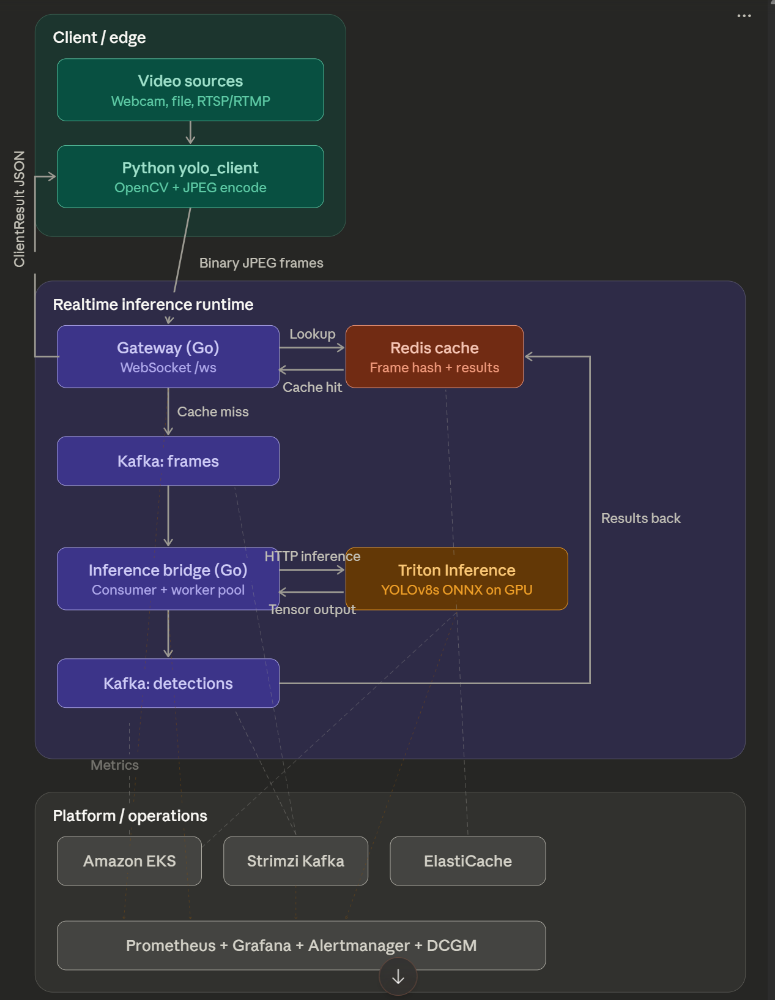

# OWL: Distributed YOLO Inference Pipeline

OWL is a production-oriented, real-time object detection system built around YOLOv8 and NVIDIA Triton Inference Server. It decouples video ingestion from GPU-heavy inference using Kafka, reduces redundant computation through a Redis-backed similarity cache, and exposes full observability via Prometheus and Grafana.

## Architecture



### Data Flow

1. **Client Capture** — The Python `yolo_client` captures frames from a webcam, video file, or RTSP/RTMP stream.
2. **WebSocket Transmission** — Frames are sent as binary JPEG payloads to the Go gateway over a persistent WebSocket connection.
3. **Similarity Check** — The gateway computes a 64-bit perceptual hash (8×8 average hash) per frame and checks Redis via Hamming distance. If the frame is similar enough to a recent one (distance ≤ threshold), the cached detection result is returned immediately.
4. **Kafka Publish** — Cache misses are published to the `frames` Kafka topic.
5. **Inference Worker Pool** — The inference service consumes frames from Kafka and dispatches work to a bounded goroutine pool. Stale frames (older than a configurable threshold) are dropped to prioritize freshness.
6. **Triton Inference** — Each worker preprocesses the JPEG into a normalized 640×640 float32 tensor and calls Triton over HTTP using the binary tensor extension protocol.
7. **Post-Processing** — Raw YOLO output (8400 predictions × 80 classes) is filtered by confidence, followed by Non-Maximum Suppression, and mapped to COCO class names.
8. **Result Routing** — Detections are published to the `detections` Kafka topic; the gateway consumes them and routes back to the originating client over WebSocket.
9. **Rendering** — The Python client draws bounding boxes and stats on the original frame using OpenCV.

## Repository Layout

```text
owl/
├── server/                  # Go backend services
│   ├── cmd/
│   │   ├── gateway/         # WebSocket gateway (HTTP :8080, metrics :9090)
│   │   └── inference/       # YOLO inference worker (metrics :9090)
│   ├── internal/
│   │   ├── config/          # Environment-based configuration
│   │   ├── kafka/           # Sarama producer/consumer wrappers
│   │   ├── metrics/         # Prometheus instrumentation
│   │   ├── models/          # YOLO ONNX model config
│   │   ├── onnx/            # Model export utilities
│   │   ├── similarity/      # Perceptual hashing + Redis cache
│   │   ├── shutdown/        # Graceful shutdown handlers
│   │   └── triton/          # Triton HTTP client
│   ├── k8s/                 # Kubernetes manifests
│   └── terraform/           # AWS infrastructure (EKS, Kafka, Redis, VPC)
│       └── modules/
│           ├── eks/
│           ├── kafka/
│           ├── monitoring/
│           ├── redis/
│           └── vpc/
├── yolo_client/             # Python client
│   ├── client.py            # Async WebSocket client
│   ├── cli.py               # CLI for webcam / video / stream input
│   ├── sources.py           # Frame capture backends
│   ├── renderer.py          # OpenCV bounding-box renderer
│   └── benchmark.py         # Performance testing harness
├── monitoring/
│   ├── grafana/             # Dashboard JSON + provisioning configs
│   └── prometheus/          # Scrape configuration
├── data/                    # Sample test images
├── bench_run.py             # Top-level benchmarking script
└── docker-compose.yml       # Full local development stack
```

## Technology Stack

| Layer | Technology |
|---|---|
| Gateway & inference services | Go 1.22, Gorilla WebSocket, IBM Sarama |
| Model serving | NVIDIA Triton 24.01, ONNX Runtime |
| Object detection model | YOLOv8s (Ultralytics 8.1.0) |
| Message queue | Apache Kafka 7.6.1 (Confluent) + Zookeeper |
| Similarity cache | Redis 7 |
| Metrics | Prometheus 2.53.0, Grafana 11.1.0 |
| Python client | Python 3.10+, asyncio, websockets, OpenCV, Pillow |
| Infrastructure | Terraform, AWS EKS, Strimzi Kafka Operator |

## Prerequisites

- Docker and Docker Compose
- Go 1.22+ (for building services directly)
- Python 3.10+ (for the client)
- NVIDIA GPU + drivers (optional; CPU execution is supported)

## Quick Start (Docker Compose)

```bash
# Start the full stack: Kafka, Redis, Triton, gateway, inference, Prometheus, Grafana
docker-compose up -d

# Stream from webcam at 15 fps
cd yolo_client
python -m venv .venv
source .venv/bin/activate        # Windows: .venv\Scripts\activate
pip install websockets opencv-python pillow
python cli.py --server ws://localhost:8080/ws webcam --fps 15

# Stream from a video file
python cli.py --server ws://localhost:8080/ws file --path /path/to/video.mp4

# View dashboards
# Grafana:    http://localhost:3000  (admin / admin)
# Prometheus: http://localhost:9090
```

The `docker-compose.yml` starts these services automatically:

| Service | Port(s) | Purpose |
|---|---|---|
| zookeeper | 2181 | Kafka coordination |
| kafka | 29092 | Message broker |
| kafka-init | — | Creates `frames` / `detections` topics (3 partitions) |
| kafka-exporter | 9308 | Kafka metrics for Prometheus |
| redis | 6379 | Similarity result cache |
| model-loader | — | Exports YOLOv8s.onnx and sets up Triton model repo |
| triton | 8000 (HTTP), 8001 (gRPC) | ONNX inference server |
| gateway | 8080 (WS), 9090 (metrics) | WebSocket entry point |
| inference | 9090 (metrics) | Inference worker service |
| prometheus | 9090 | Metrics collection |
| grafana | 3000 | Dashboards |

## Running Services Manually

### Go Gateway

```bash
cd server
go mod tidy
go run ./cmd/gateway
```

### Go Inference Service

```bash
cd server
TRITON_HTTP_ADDR=localhost:8000 go run ./cmd/inference
```

### Docker Image Builds

```bash
# Gateway
docker build -f server/cmd/gateway/Dockerfile.gateway -t owl-gateway server/

# Inference
docker build -f server/cmd/inference/Dockerfile.inference -t owl-inference server/
```

## Configuration

All services are configured via environment variables.

### Gateway (`cmd/gateway`)

| Variable | Default | Description |
|---|---|---|
| `KAFKA_BROKERS` | `kafka:29092` | Comma-separated broker list |
| `REDIS_ADDR` | `redis:6379` | Redis address |
| `SIMILARITY_THRESHOLD` | `-1` | Hamming distance threshold; `-1` disables caching |
| `CACHE_TTL_SECONDS` | `30` | Redis result TTL |
| `STALE_FRAME_THRESHOLD_MS` | `5000` | Drop results older than this |

### Inference (`cmd/inference`)

| Variable | Default | Description |
|---|---|---|
| `TRITON_HTTP_ADDR` | `triton:8000` | Triton server address |
| `KAFKA_BROKERS` | `kafka:29092` | Comma-separated broker list |
| `NUM_WORKERS` | `4` | Worker goroutine pool size |
| `CONFIDENCE_THRESHOLD` | `0.5` | YOLO confidence filter |
| `STALE_FRAME_THRESHOLD_MS` | `5000` | Drop frames older than this |
| `TRITON_EXECUTION_TARGET` | `cpu` | `cpu` or `gpu` |

## Observability

### Prometheus Metrics

**Gateway**

| Metric | Description |
|---|---|
| `gateway_active_clients` | Currently connected WebSocket clients |
| `gateway_frames_received_total` | Total frames received from clients |
| `gateway_cache_hits_total` | Frames served from similarity cache |
| `gateway_cache_misses_total` | Frames forwarded to Kafka |
| `gateway_cache_lookup_seconds` | Hash computation + Redis lookup latency |
| `gateway_e2e_latency_seconds` | Full round-trip latency (client send → result received) |
| `gateway_frames_published_total` | Frames published to Kafka |
| `gateway_detections_consumed_total` | Detection results consumed from Kafka |

**Inference**

| Metric | Description |
|---|---|
| `yolo_frames_processed_total` | Frames successfully inferred |
| `yolo_frames_dropped_total` | Frames dropped (stale / superseded / queue full) |
| `yolo_frames_dropped_reason_total` | Drop breakdown by reason label |
| `yolo_inference_duration_seconds` | Per-frame Triton inference latency |
| `yolo_detections_per_frame` | Histogram of object count per frame |
| `yolo_worker_pool_active` | Active workers in the pool |
| `yolo_worker_pool_queue_depth` | Job queue backlog depth |
| `yolo_results_published_total` | Detection results published to Kafka |

### Grafana Dashboards

Pre-built dashboards in `monitoring/grafana/dashboards/`:

- **owl-server-e2e-flow** — End-to-end latency, throughput, cache hit rate, Kafka lag
- **owl-local-triton** — Triton CPU inference metrics
- **owl-dcgm-triton** — GPU utilization and memory (DCGM, requires GPU node)

## Benchmarking

```bash
# Run a 60-second benchmark at 30 fps
python bench_run.py --server ws://localhost:8080/ws --duration 60 --fps 30

# Or use the client-side harness directly
cd yolo_client
python benchmark.py --server ws://localhost:8080/ws --duration 60 --concurrency 4
```

## Kubernetes Deployment

Kubernetes manifests are in `server/k8s/`. Apply them to any cluster:

```bash
kubectl apply -f server/k8s/dump.yaml
```

For a full AWS deployment using Terraform:

```bash
cd server/terraform
terraform init
terraform apply
```

The Terraform configuration provisions:
- **VPC** with private/public subnets and NAT gateways
- **EKS** cluster with CPU and GPU node groups
- **Kafka** via the Strimzi operator
- **Redis** via ElastiCache
- **Prometheus + Grafana** via the monitoring module

## Design Decisions

| Decision | Rationale |
|---|---|
| Kafka for frame/result transport | Decouples API latency from inference latency; enables backpressure and horizontal consumer scaling |
| Bounded worker pool + stale dropping | Prevents memory growth under load; fresh frames are prioritized over queued ones |
| Redis perceptual hash cache | Avoids re-running expensive inference on near-duplicate frames; hash computation costs ~0.1 ms |
| Triton Inference Server | Standardized ONNX serving with GPU support and production-grade request handling |
| WebSocket gateway | Enables bidirectional streaming for real-time result delivery without client polling |
| Prometheus + Grafana | Native metrics pipeline for SLA validation, debugging, and capacity planning |
| Stateless Go services | Simplifies horizontal scaling; all shared state lives in Kafka and Redis |
