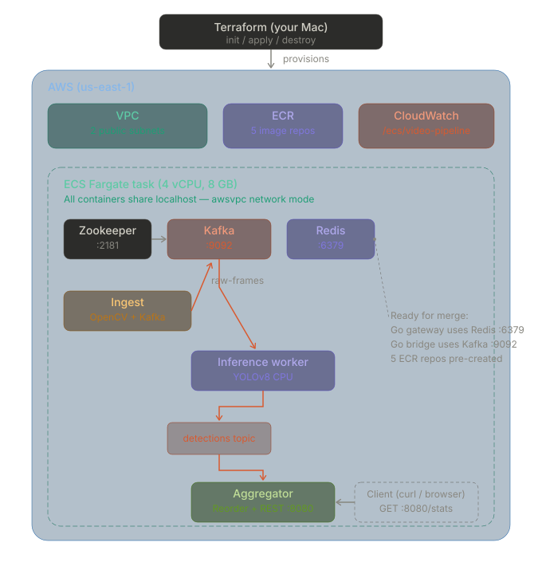

# OWL - Cloud Deployment Design Document

## What this branch does

Deploys a distributed real-time video inference pipeline on AWS using Terraform and ECS Fargate. Six containers run inside a single Fargate task sharing localhost: Zookeeper, Kafka, Redis, an ingest service, a YOLOv8 inference worker, and a REST aggregator.

The infrastructure is designed as a deployment foundation for the team. Kafka and Redis are running and pre-wired for Karthik's Go gateway and inference bridge. Five ECR repos are provisioned - three populated (ingest, worker, aggregator), two empty and waiting (gateway, inference-bridge).

## My deployment architecture



I built the Terraform-managed AWS platform that provisions the runtime environment. My branch adapts the team architecture for ECS Fargate - the only compute option available in our AWS Academy Learner Lab.

---

## Why Fargate (not EKS or EC2)

The team architecture targets EKS with GPU nodes. When I deployed, the Learner Lab blocked every alternative:

| What I tried | Result |
|---|---|
| `g4dn.xlarge` (GPU instance) | `AccessDenied` — explicit deny in `Pvoclabs2` policy |
| `t3.xlarge` (CPU instance) | Same deny — ALL `ec2:RunInstances` blocked |
| EKS node group | Cluster creates, node group fails (needs EC2) |
| Create new IAM role for EKS | `iam:CreateRole` denied |

Fargate is serverless — no EC2 from our account's perspective. `LabRole` has the permissions for Fargate execution, ECR pulls, and CloudWatch writes.

Tradeoff: no GPU. YOLOv8 runs on CPU at ~5-15 fps instead of ~200 fps. Pipeline logic is identical either way.

---

## What Terraform creates

17 AWS resources across 4 modules:

| Module | Resources | Key detail |
|--------|-----------|------------|
| `vpc` | VPC, 2 subnets, IGW, route table, security group | Ports 5000 + 8081 open |
| `ecr` | 5 repositories | 3 active + 2 ready for Go services |
| `logging` | CloudWatch log group | 7-day retention, per-container streams |
| `ecs` | Cluster, task definition, Fargate service | 6 containers, 4 vCPU / 8 GB |

No EC2, no ASG, no launch templates, no EKS, no NAT gateway.

---

## Container resource allocation

```
Container          CPU     Memory    Essential    Role
─────────          ───     ──────    ─────────    ────
Zookeeper          128     512 MB    yes          Kafka coordination
Kafka              512     1536 MB   yes          Streaming backbone
Redis              128     256 MB    yes          Similarity cache (for Go gateway)
Ingest             256     512 MB    no           Video frame producer
Inference worker   2048    4096 MB   no           YOLOv8 CPU inference
Aggregator         512     1024 MB   yes          Reorder buffer + REST API
─────────          ────    ────────
Total              4096    8192 MB
```

Worker gets half the task's compute because CPU inference is compute-bound. Ingest and aggregator are I/O-bound.

---

## Data flow

```
Video file (baked into Docker image)
    → OpenCV reads frame
    → JPEG encode (raw bytes, not Base64)
    → Kafka produce to "raw-frames" (key=stream_id, metadata in headers)
    → Worker consumes, decodes JPEG, runs YOLOv8n
    → Detection JSON to Kafka "detections"
    → Aggregator consumes, reorder buffer emits in frame_id order
    → REST API at :5000
```

---

## The reorder buffer

The aggregator's `ReorderBuffer` works like TCP's receive window:

- Tracks `next_expected` frame_id per stream
- Buffers out-of-order arrivals in a dict
- Emits consecutive runs when the expected frame shows up
- Drops late frames (`frame_id < next_expected`)
- Force-advances after 30 buffered frames if a frame is lost

With one worker, frames arrive in order — the buffer is a pass-through. It becomes essential with multiple workers processing at different speeds.

---

## Design decisions

**Raw JPEG over Kafka, not Base64+JSON.** Frame bytes go directly as Kafka values. Metadata in Kafka headers. Avoids ~33% Base64 overhead.

**Single Fargate task, shared fate.** All 6 containers in one task sharing localhost. If Kafka dies, everything restarts. Simpler than separate tasks with Cloud Map service discovery.

**5 ECR repos from day one.** Two are empty — `video-pipeline-gateway` and `video-pipeline-inference-bridge`. When Karthik pushes Go images, no Terraform changes needed.

**Redis deployed but unused by Python services.** Running at `localhost:6379` for when the Go gateway needs similarity caching. Zero wasted effort on merge day.

**`essential = false` on ingest and worker.** If the worker OOMs, ECS restarts just that container. Kafka and the aggregator keep running.

---

## Preliminary results

Pipeline running live on Fargate:

```json
{
    "uptime_seconds": 120.4,
    "total_consumed": 347,
    "throughput_fps": 2.88,
    "streams": [{
        "stream_id": "stream-0",
        "total_received": 347,
        "total_emitted": 347,
        "dropped": 0,
        "reordered": 0
    }]
}
```

Zero drops, zero reorder events (expected with one worker). ~3 fps throughput on Fargate CPU.

---

## How to deploy

```bash
# 0. Paste fresh Learner Lab credentials into ~/.aws/credentials
# 1. Deploy
cd terraform && terraform init && terraform apply
# 2. Build + push
ACCT=$(aws sts get-caller-identity --query Account --output text)
./scripts/build-and-push.sh $ACCT us-east-1
# 3. Redeploy
./scripts/force-redeploy.sh
# 4. Get IP
./scripts/get-task-ip.sh
# 5. Test
curl http://<IP>:5000/stats | python3 -m json.tool
# 6. Destroy
cd terraform && terraform destroy
```

~$0.20/hr while running. Zero after destroy.

---

## Known limitations

- **No GPU** — Fargate doesn't support GPUs; CPU inference at ~5-15 fps
- **Ephemeral storage** — Kafka data lost on task restart
- **Dynamic IP** — changes every redeployment; no ALB
- **Credentials expire** — Learner Lab sessions ~4 hours
- **Observability configs exist but not yet deployed** — Prometheus/Grafana planned for Week 2

---

## Merge readiness

Redis at `localhost:6379`. Kafka at `localhost:9092`. ECR repos exist.

When Karthik's Go services are containerized:

```bash
docker build --platform linux/amd64 -t $REG/video-pipeline-gateway:latest .
docker push $REG/video-pipeline-gateway:latest
```

Add two container definitions to the Fargate task. Everything else stays.
