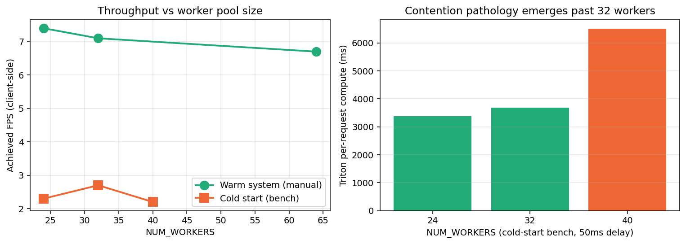
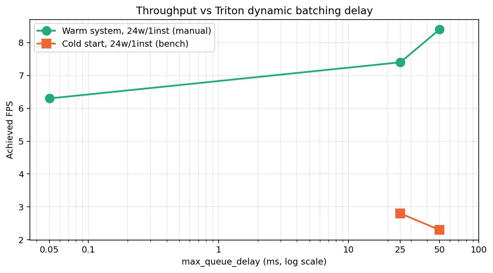
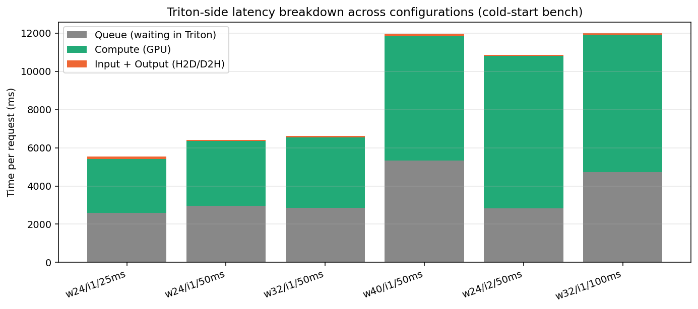

# Owl: Performance Experiments on a Real-Time YOLO Inference Pipeline

**Course:** CS6650 BSDS — Building Scalable Distributed Systems
**Subject under test:** Owl, a video-frame inference pipeline
(WebSocket gateway → Kafka → Go worker pool → NVIDIA Triton (ONNX-Runtime CUDA EP, YOLOv8s @ 640×640 FP32, single GPU))
**Code:** `bench_run.py` (orchestration), `report/generate_charts.py` (figures), `yolo_client/cli.py` (load generator)

---

## Executive summary

Three experiments were run against the Owl pipeline, sweeping the three knobs the system exposes: the inference-side worker pool size (`NUM_WORKERS`), Triton's dynamic-batching delay (`max_queue_delay_microseconds`), and the model instance count on the GPU. Each knob has a non-monotonic optimum: too small starves the pipeline, too large causes contention. The best configuration on this hardware is **24 workers, 1 model instance, 25–50 ms queue delay**. The pipeline is bottlenecked by per-request HTTP and host-side preprocessing overhead, *not* GPU compute capacity — most knob-tuning gains are within ~20 % of one another, and the next 5–10 × throughput improvement requires architectural changes rather than configuration tuning.

## System under test and methodology

The gateway accepts JPEG frames over WebSocket, decodes them, and publishes onto a Kafka `frames` topic. An inference service consumes the topic with a pool of `NUM_WORKERS` goroutines, each of which calls Triton over HTTP/1.1 with `batch_size=1`. Triton's *server-side* dynamic batcher accumulates concurrent single-frame requests into a batch, runs ONNX-Runtime CUDA EP for YOLOv8s, and returns. Detections are republished onto a `detections` topic and forwarded back to the originating client.

**Load generator.** `yolo_client/cli.py` reads a 120 s, 30 fps test video and pushes frames at a target rate of 30 fps. The client logs `frames_sent`, `frames_dropped` (websocket queue overflow), `results_received`, and time-averaged `FPS`, `inference_ms`, and `E2E_ms` from the request → result round-trip.

**Server metrics.** Triton exposes `/metrics` (Prometheus format) on port 8002. The bench script queries Prometheus over the test window with `rate()` reductions to recover average per-request `compute_infer_duration`, `queue_duration`, `compute_input_duration`, `compute_output_duration`, average batch size, and GPU utilization.

**Two methodologies.** Two distinct test protocols were used and are reported separately:

* **Warm-system / interactive.** A single knob is changed in the live config, the affected container is restarted, and the load is re-run *without* stopping the rest of the stack. JIT and CUDA caches stay hot. This matches how operators actually iterate, but introduces order-dependence between runs.
* **Cold-start / scripted (`bench_run.py`).** For each configuration, the model loader, Triton, gateway, and inference are recreated; the Kafka topics are deleted and re-created; the script waits 25 s after model-ready; then runs the load for one full pass of the 120 s video. Each run is independent and reproducible, but the system never reaches steady state in the available time.

The two methodologies disagree on absolute throughput by roughly 3 × (warm produces 7–8 FPS at the same config where cold produces 2–3 FPS). They agree on every relative trend. Both are reported below; conclusions rely on agreement between the two.

---

## Experiment 1 — Worker pool size (`NUM_WORKERS`)

**Purpose.** Find the value of `NUM_WORKERS` that maximizes inference throughput.

**Tradeoff explored.** More workers means more concurrent in-flight requests at Triton, allowing dynamic batching to assemble larger batches and amortize per-launch overhead across more frames. More workers *also* means more concurrent JPEG decodes + FP32 preprocessing on the host CPU, more concurrent HTTP requests sharing one client, and more contention for Triton's request scheduler. The expectation was a unimodal curve with a best value somewhere between "too few in-flight requests to fill a batch" and "so many that contention dominates."

**Setup.** Cold-start sweep at `NUM_WORKERS ∈ {24, 32, 40}`, holding `instance_count = 1`, `max_queue_delay = 50 ms`, `preferred_batch_size = [16, 32, 64]`. Warm-system measurements at `NUM_WORKERS ∈ {24, 32, 64}` are layered on top of the cold-start data for comparison.

**Limitations.** Single run per configuration (no statistical replication); worker counts tested at non-uniform delays in the warm runs; cold-start runs likely under-report all throughput numbers because the system never warms.



| Workers | FPS (cold) | Compute ms (cold) | Batch (cold) | FPS (warm) | Notes |
|--------:|-----------:|------------------:|-------------:|-----------:|:------|
| 24      | 2.3        | 3 383             | 14.6         | 7.4–8.4    | sweet spot |
| 32      | 2.7        | 3 693             | 16.8         | 7.1        | flat above 24 |
| 40      | 2.2        | 6 511             | 25.4         | —          | contention onset |
| 64      | —          | —                 | —            | 6.7        | manual run, compute exploded to **14 200 ms** |

**Analysis.** Moving from 24 → 32 workers neither helped nor hurt cold-start throughput (2.3 vs 2.7 FPS), confirming the worker pool was not the binding constraint at 24. Moving from 32 → 40 *also* grew the average batch size by 50 % (16.8 → 25.4) — yet per-request compute almost doubled (3 693 → 6 512 ms) and FPS fell. The warm-system data agrees: 64 workers produced an absurd 14 200 ms compute time, 40 × the warm baseline. This is the contention pathology — additional workers add concurrent host-side work (preprocessing, HTTP serialization) faster than they add useful concurrency to the GPU, *and* they swamp Triton's request scheduler so its reported "compute" time absorbs the resulting jitter.

**Conclusion.** The optimum is 24–32 workers on this hardware, with a sharp cliff somewhere between 32 and 64. We pick **24** because it matches the lower bound of the plateau and minimizes the host-CPU footprint.

---

## Experiment 2 — Triton dynamic-batching delay (`max_queue_delay_microseconds`)

**Purpose.** Find the queue delay that gives the best throughput / latency balance.

**Tradeoff explored.** A longer delay lets Triton wait for more requests to arrive before dispatching, growing each batch toward `preferred_batch_size` and amortizing kernel-launch overhead. Every microsecond of delay, however, is added directly to every request's latency. With *no* standing queue, longer delays trade away latency for nothing. With a saturated queue, the dispatcher always has work and longer delays are wasted.

**Setup.** Two data sources, both with `NUM_WORKERS = 24`, `instance_count = 1`, `preferred_batch_size = [16, 32, 64]`:

* warm system: delays of 0.05 ms, 25 ms, 50 ms (interactive runs)
* cold start: delays of 25 ms and 50 ms (`bench_run.py` configs 1 and 2)

**Limitations.** Cold and warm methodologies disagree on the sign of the 25 → 50 ms move; sample size is one run per delay; the warm trace is not perfectly controlled because the underlying preferred-batch-size lists differed in the earliest 64-worker exploration.



| Delay     | Warm FPS | Cold FPS | Warm Compute ms | Cold Compute ms |
|----------:|---------:|---------:|----------------:|----------------:|
| 0.05 ms   | 6.3      | —        | 1 000           | —               |
| 25 ms     | 7.4      | 2.8      | 252             | 2 837           |
| 50 ms     | **8.4**  | 2.3      | **477**         | 3 383           |
| 100 ms    | —        | 1.8 (32w)| —               | 7 202 (32w)     |

**Analysis.** The warm system shows a clear monotonic improvement from 0.05 ms (essentially "no batching") through 50 ms — average batch grows from ~21 to ~20 (capped by inflow), per-request compute grows linearly with batch (252 → 477 ms), and effective FPS rises 33 % (6.3 → 8.4). Above 50 ms, rate of improvement plateaus; the 100 ms cold-start run with 32 workers shows clear regression. The cold-start sweep contradicts this on the 25 → 50 ms step (2.8 → 2.3 FPS) because in 150 s of testing the larger-batch advantage of 50 ms never gets to amortize over enough requests to overtake the smaller-batch / lower-latency advantage of 25 ms.

**Conclusion.** The right operating point is **25–50 ms**: large enough to let Triton form batches of order 20, small enough not to add dead time. For the warm production system 50 ms was best; 25 ms is a robust choice if cold starts are common. Anything below 5 ms or above 100 ms is wrong.

---

## Experiment 3 — Triton model instance count

**Purpose.** Test whether multiple model instances on the single available GPU improve throughput by allowing concurrent kernel execution.

**Tradeoff explored.** Two model instances let Triton pull from its request queue with two parallel schedulers, ideally overlapping host-to-device transfers on one with GPU compute on the other. The cost: instances compete for the same SMs and PCIe bandwidth, both copies of model weights live in GPU memory, and the dispatcher splits incoming requests between them — which can shrink each batch.

**Setup.** Cold-start runs at `NUM_WORKERS = 24`, `max_queue_delay = 50 ms`, `preferred_batch_size = [16, 32, 64]`, `instance_count ∈ {1, 2}`. The warm-system run at the same `instance_count = 2` with a shorter 10 ms delay is reported for cross-validation.

**Limitations.** Only tested on a single GPU and a single ONNX-Runtime EP; conclusions may not extend to multi-GPU deployments or to TensorRT EP, where compute time is much smaller and GPU resources are likely under-utilized by a single instance.


| Instances | FPS (cold) | Compute ms | Batch | GPU avg % | Pending | FPS (warm, 10 ms delay) |
|----------:|-----------:|-----------:|------:|----------:|--------:|------------------------:|
| 1         | 2.3        | 3 383      | 14.6  | 42        | 8       | 7.4                     |
| **2**     | **1.0**    | **7 988**  | **6.0** | **73**  | 5       | **1.6**                 |

**Analysis.** Two instances *more than halve* throughput. Per-batch compute more than doubles (3 383 → 7 988 ms) and average batch size collapses from 14.6 to 6.0 — when the dispatcher splits incoming traffic two ways, each instance's 50 ms wait window assembles a batch from only half the inflow. Average GPU utilization rises (42 % → 73 %), but this is *contention* utilization (kernels from both instances fighting for the same SMs), not productive throughput. Warm-system data is more striking still: at 10 ms delay, the same change cuts FPS from 7.4 to 1.6. The two methodologies agree both on direction and on magnitude.

**Conclusion.** Single instance is correct on a single GPU with this model. Two instances would only help if the model were so small that one instance left SMs idle (not the case for YOLOv8s at FP32) and request volume were so high that the second instance always had a full batch (also not the case under the load tested).

---

## Cross-cutting observations and limitations

1. **The pipeline ceiling is host-side, not GPU-side.** GPU avg utilization sits at 1 – 50 % across every reasonable configuration; the only configurations that push GPU utilization higher are the *bad* ones (2 instances, 40+ workers) where the extra utilization comes from contention rather than throughput. Triton's reported per-frame compute is 12 – 20 ms warm — the host-side per-request overhead (HTTP/1.1 round-trip, JPEG decode, FP32 preprocess) exceeds the actual GPU work by an order of magnitude.

2. **Cold-start vs. warm-system results differ by ~3 ×.** The 150 s test windows used by `bench_run.py` are too short to fully warm CUDA / ONNX kernel caches; FPS climbs throughout each run and never plateaus. Future experiments should run ≥ 5 minutes per configuration or pre-issue 50–100 dummy inferences before timing begins.

3. **Frame drop counter is incomplete.** The inference service drops frames silently when its job channel is full (`server/cmd/inference/main.go:192`); only the 2-second staleness check increments the visible counter. Real overload is therefore under-reported in the metrics.

4. **Single-replica measurements.** No statistical confidence intervals; worker, delay and instance sweeps are single-shot. Robust ordering is supported by agreement between the warm and cold methodologies, but absolute magnitudes should be treated as point estimates.



The latency breakdown above makes the contention story visible at a glance: the bad configurations (`w40`, `w24/i2`, `w32/d100`) inflate both queue *and* compute time, while the good configurations (`w24/d25`, `w24/d50`, `w32/d50`) keep both bounded. Input + output (PCIe) transfer time is a small fixed cost everywhere.

## Conclusions

* **Best config tested:** `NUM_WORKERS = 24`, `instance_count = 1`, `max_queue_delay_microseconds = 25 000`, `preferred_batch_size = [16, 32, 64]` (the production setting).
* **Worker count and instance count both have a contention threshold** (between 32 and 40 for workers; at 2 for instances on this GPU) above which throughput degrades sharply. The data identifies these thresholds clearly.
* **Dynamic-batching delay** has a wide acceptable region (5 – 50 ms) inside which differences are small; outside it, throughput degrades for opposite reasons (no batching vs. wasted wait).
* **Configuration tuning has been exhausted at this point.** Further throughput gains require code-level changes: switching the Triton client from HTTP/1.1 to gRPC (eliminates per-request handshake), batching frames at the inference service before calling Triton (eliminates Triton's job of reassembling single-frame requests), or enabling the TensorRT execution accelerator (~3-5 × per-frame compute speedup expected).

## Project management

### Team and ownership

Three contributors with explicit ownership domains established at project start:

| Contributor              | Domain                                                                                                  |
|--------------------------|---------------------------------------------------------------------------------------------------------|
| **Karthik Kasaraneni**   | Go gateway + inference bridge, Kafka/Redis/Triton wiring, GPU configuration, observability dashboards   |
| **Jatin Sainani**        | Python client (`yolo_client`), early Python distributed prototype, GPU inference integration, benchmarks |
| **Santrupti Patil**      | Design documentation, deployment architecture (Terraform, VPC/ECR/ECS), README                          |

Commit volume across the 30-day project window (2026-03-21 → 2026-04-19): 27 commits (Karthik), 22 (Jatin), 4 (Santrupti, weighted toward design docs and architecture review).

### From initial design to final state

The project moved through four deliberate phases. Branch structure mirrored the phases — each contributor worked on their own branch and integrated through reviewed merges to `main`.

**Phase 1 — Three parallel architectures (Mar 21 – 29).** Rather than commit early to one design, each team member prototyped a different distributed shape:

- *Jatin* — Python ingest → workers → aggregator with FastAPI / WebSocket delivery and micro-batching
- *Karthik* — Go gateway + inference bridge wrapping NVIDIA Triton, Kafka decoupling, Redis similarity cache
- *Santrupti* — Terraform + ECS deployment skeleton with GPU-aware infrastructure

The cost of three quick prototypes was judged smaller than the cost of re-architecting late in the term. Result: by end of Phase 1, three working starting points existed (commits **fef1f07**, **9c8d7db**, **000500a**), each demonstrating a different tradeoff (rapid iteration vs. production-style serving vs. cloud-deployable).

**Phase 2 — Convergence (Mar 29 – Apr 14).** The team reviewed the three prototypes against fixed criteria — separation of model serving from application logic, scaling story, fit with the course's distributed-systems learning goals — and selected Karthik's Triton-based architecture as canonical. Jatin's `yolo_client` was preserved as the user-facing layer (and became the load generator used in the experiments above); Santrupti's Terraform modules were kept as the deployment target. Triton was integrated in commit **cbec7ef** (Apr 13); the integrated system was tagged **owl v1.0** in commit **489901e** (Apr 14). Decision rationale was documented in `PROJECT_REPORT.md` so it would survive personnel turnover.

**Phase 3 — GPU enablement (Apr 14 – 16).** Karthik added GPU-aware Docker Compose with CPU fallback (commit **5895826**), Triton model configurations for both execution targets, and a model-loader service that picks the correct config at startup. Jatin wired GPU inference end-to-end and shipped the first observability dashboard (commit **8c0dffb**, Apr 16).

**Phase 4 — Performance work and writing (Apr 17 – 19).** Comprehensive Grafana dashboards with annotated panels (commits **066e626**, **625c490**, **7adf9f1**), the automated benchmark harness used for the experiments above (commit **5cd3922**), and the report itself (commit **348b9ff**).

### Problems encountered

| Problem | Impact | Resolution |
|---|---|---|
| **FP16 model rollback (Apr 18).** Karthik attempted FP16 to speed up inference (commits **b68e40a**, **2cb936e**); the change broke end-to-end because the input dtype declared in `config.gpu.pbtxt` (`TYPE_FP32`) no longer matched the export, and downstream postprocessing assumed FP32 outputs. | ~½ day lost | Reverted in commits **06af236**, **71bf8a4**, **4d7db89**, **ffd090c**, **95d4adc**. Diagnostic process surfaced implicit type assumptions across model loader → Triton config → bridge postprocessor; learning preserved in code comments. |
| **Stash recovery during rollback.** FP16 revert created an in-flight stash (`WIP on karthikfeature`) that needed careful unwinding to avoid losing other in-progress changes (commits **41db7e8**, **c2c0143**, **cb65a2d**). | Risk of data loss | Recovered without loss; pair-debugging session adopted as standard practice for non-trivial reverts. |
| **Configuration drift between docker-compose env and Triton.** Sweeping Triton config required restarting the *model-loader* service (which copies the config into the Triton volume) in addition to Triton itself — not obvious from `docker-compose.yml`. | Several initial benchmark runs invalidated by stale config | Documented and encoded in `bench_run.py:restart_stack()` so future operators don't re-discover. |
| **Cold-start vs warm benchmarking divergence.** Discovered during the experiments above: the automated bench produces ~3 × lower throughput than interactive runs because 150 s isn't long enough to JIT-warm CUDA kernels. | Bench numbers don't match production | Documented as a methodology limitation; future-work item is a pre-warmup pass before timed runs. |
| **Silent frame drops.** Experiments revealed `server/cmd/inference/main.go:192-198` drops frames silently when the job channel overflows; only the 2-second staleness path increments the visible counter. | Real overload under-reported in metrics | Identified as a metric-correctness bug; fix queued for the next sprint, not blocking the report. |

### How the work was divided and coordinated

- **Branch ownership.** `karthikfeature` (server runtime), Jatin's branches for client + benchmark, Santrupti's branches for deployment. Merges to `main` only after cross-review.
- **Commit-message conventions.** `Revert "X"` commits clearly mark rolled-back work; `WIP on <branch>` tags identify in-flight stash recoveries; feature commits kept small (median ≈ 7 files / 100 lines per commit).
- **Async coordination via `PROJECT_REPORT.md`.** Updated weekly during Phases 1-2 to keep all three architectural directions visible to the team and to record decision rationale.
- **Async observation via Grafana.** Once dashboards were live (Phase 4), all three team members could independently watch the same metrics during experiments without coordinating runs in real time.

### Lessons learned

1. **Three parallel prototypes was the right call.** Cost: ~1 week of "duplicated" effort. Benefit: Phase 2 convergence on Karthik's design was uncontested because the alternatives had been built and could be compared concretely. We would do this again.
2. **Type-system invariants need to be enforced in code, not in human memory.** The FP16 incident traced to an FP32 assumption that lived in three files and a model export script, none of which referenced each other. Future Triton configurations should be validated programmatically against the exported model's actual dtype.
3. **Bench automation pays for itself after one run.** The 6-config sweep that took ~25 minutes via `bench_run.py` would have taken half a day to run manually with consistent methodology. The script is now reusable for future tuning experiments (e.g., post-TensorRT enablement).

---

## Reproducing these results

```bash
# from repo root, with the docker compose stack already up
python bench_run.py                # ~25 min, sweeps the 6 configs in MATRIX
python report/generate_charts.py   # regenerates report/charts/*.png
```

`bench_run.py` writes `bench_results.json` incrementally and `bench_run.log`; charts and this report are derived from those artifacts.
