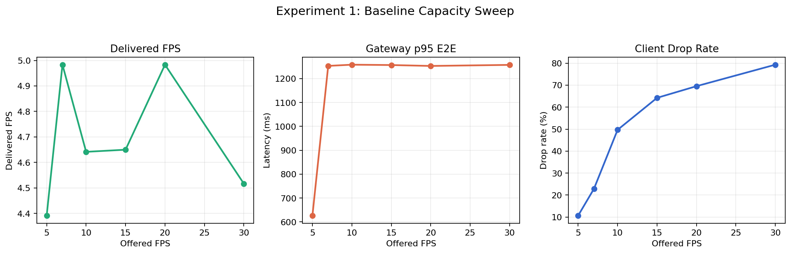
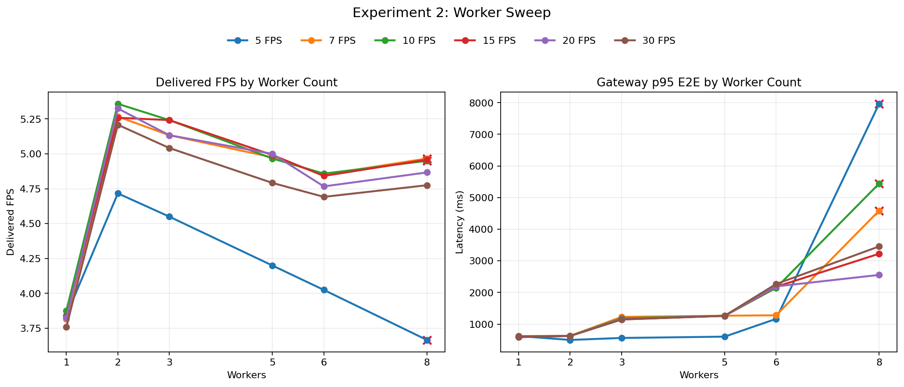
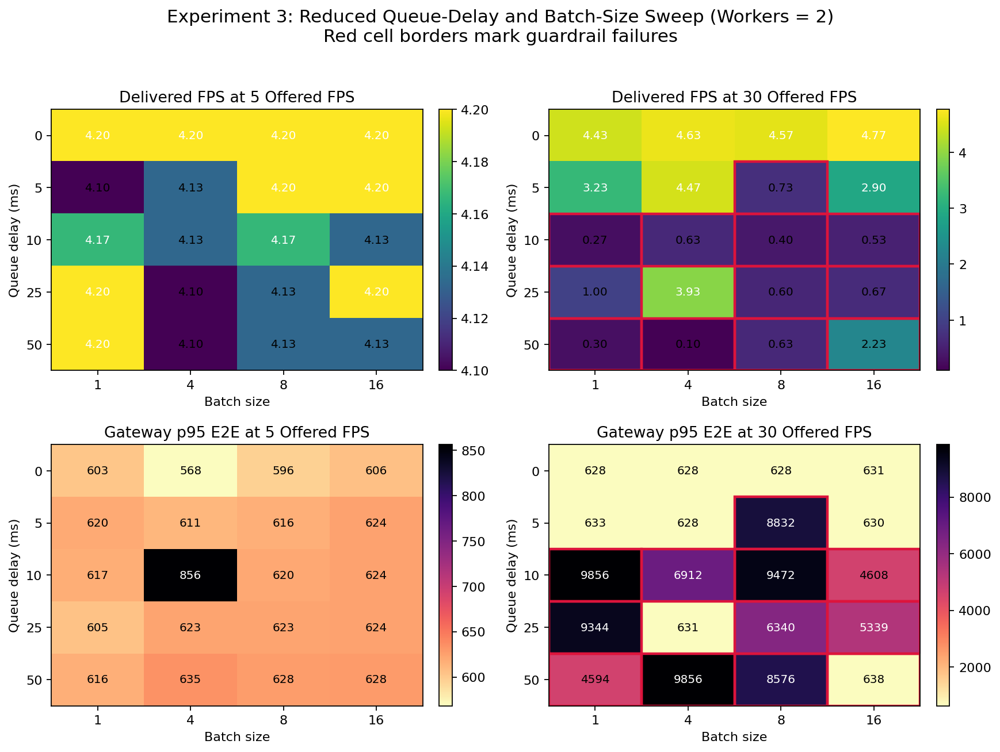
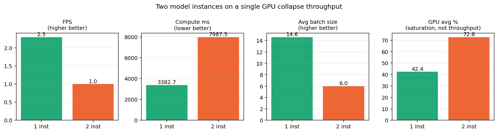

# Owl: Experiments and Results

**Course:** CS6650 BSDS - Building Scalable Distributed Systems  
**System under test:** WebSocket gateway -> Kafka -> Go inference workers -> NVIDIA Triton serving YOLOv8s on one GPU  
**Artifacts:** `bench_run.py`, `report/bench_results.json`, `report/generate_charts.py`

## Executive Summary

This report evaluates Owl as a real-time video inference pipeline using three experiments that each isolate one operational tradeoff:

1. **Baseline capacity sweep:** How does the system behave as offered frame rate increases?
2. **Worker-count sweep:** How much host-side concurrency helps before contention dominates?
3. **Reduced batching sweep:** Once the best worker count is chosen, do Triton queue delay and preferred batch size still matter?

Three main findings emerged from the data:

- The pipeline saturates at roughly **4.5 to 5.0 delivered FPS** even when offered FPS is much higher.
- The best worker setting is **2 workers**. It improved both throughput and latency over the baseline `4-worker` configuration.
- In the reduced stage 3 sweep, **queue delay was the dominant batching knob**. At `30 FPS`, any positive delay usually hurt badly, while changing preferred batch size had only a small effect because Triton still observed an average batch size of about `1.0`.

## Methodology

All benchmark runs were orchestrated with `bench_run.py`, which recreates the benchmark services, resets Redis and Kafka state, and records both client-side and Prometheus-side metrics. The primary metrics used in this report are:

- **Delivered FPS:** effective end-to-end throughput seen by the client
- **Gateway p95 E2E latency:** p95 latency across the pipeline
- **Client drop rate:** fraction of frames that did not yield a result at the client
- **Queue full / stale rate:** server-side drop reasons from Prometheus
- **Triton average batch size and request time:** evidence about batching behavior

Experiments 1 and 2 used the default runner timings:

- `30s` warmup
- `120s` measured window
- `5s` settle

Experiment 3 had a different timings:

- `5s` warmup
- `30s` measured window
- `2s` settle


## Experiment 1: Baseline Capacity Sweep

**Purpose.** Establish the capacity curve of the pipeline as offered FPS rises.

**Tradeoff explored.** Higher offered FPS should increase useful throughput only until the pipeline saturates. After saturation, additional input should mostly increase latency and dropped work.

**Limitations.** This experiment uses one run per offered FPS and a single baseline configuration: `workers=4`, `queue delay=2 ms`, `batch size=8`, `similarity threshold=-1`.



| Offered FPS | Delivered FPS | Client drop % | Gateway p95 E2E ms |
| ---: | ---: | ---: | ---: |
| 5  | 4.39 | 10.68 | 626.64 |
| 7  | 4.98 | 22.85 | 1253.35 |
| 10 | 4.64 | 49.68 | 1258.36 |
| 15 | 4.65 | 64.23 | 1256.87 |
| 20 | 4.98 | 69.54 | 1253.13 |
| 30 | 4.52 | 79.31 | 1257.52 |

**Results and analysis.** The pipeline reaches its practical ceiling almost immediately. Delivered FPS stays near `4.4 to 5.0` across the entire sweep, while client drop rate rises from `10.68%` at `5 FPS` to `79.31%` at `30 FPS`. Latency also jumps sharply between `5 FPS` and `7 FPS`, then remains around `1.25s`.

The evidence suggests the system is **throughput-limited well below the offered load**. Importantly, `queue_full_rate_pct` and `stale_rate_pct` remained `0.0` for all baseline runs, so the dominant bottleneck is not Kafka backlog management or explicit stale-frame dropping. Instead, the system simply cannot return results much faster than about `5 FPS` end to end.
Using the measured worker service time, the maximum sustainable throughput is approximately `max_fps ~= workers / (avg_inference_ms / 1000) = (1000 x workers) / avg_inference_ms`.

For the saturated baseline runs, `workers = 4` and `avg_inference_ms` was about `805.72 to 889.73 ms` in `report/bench_results.json`, so `max_fps ~= 4000 / 805.72 = 4.96` on the best run and `4000 / 889.73 = 4.50` on the slowest saturated run. That predicted `4.5 to 5.0 FPS` ceiling matches the observed delivered throughput almost exactly.

**Conclusion.** The baseline system saturates at about `5 delivered FPS`. Any tuning experiment that follows should optimize around that ceiling rather than assume throughput will scale linearly with offered input.

## Experiment 2: Worker-Count Sweep

**Purpose.** Find the inference worker count that best balances useful concurrency against contention.

**Tradeoff explored.** More workers increase the number of in-flight Triton requests and could improve throughput. But they also add host-side preprocessing, HTTP concurrency, scheduler contention, and internal queue pressure.

**Setup.** Full stage 2 sweep over worker counts `{1, 2, 3, 5, 6, 8}` across offered FPS `{5, 7, 10, 15, 20, 30}`. This produced `36` runs total; `33` passed the hard guardrails.

**Limitations.** Single run per configuration; no repeated trials. Absolute values should be treated as point estimates, but the ranking across worker counts is still informative.



Best throughput by offered FPS:

| Offered FPS | Best workers | Delivered FPS | Client drop % | Gateway p95 E2E ms |
| ---: | ---: | ---: | ---: | ---: |
| 5  | 2 | 4.72 | 3.74 | 499.73 |
| 7  | 2 | 5.27 | 18.77 | 626.92 |
| 10 | 2 | 5.36 | 42.07 | 624.92 |
| 15 | 2 | 5.26 | 59.50 | 624.97 |
| 20 | 2 | 5.33 | 67.50 | 625.41 |
| 30 | 2 | 5.21 | 76.28 | 625.47 |

Guardrail failures:

| Workers | Offered FPS | Delivered FPS | Gateway p95 E2E ms | Failed check |
| ---: | ---: | ---: | ---: | --- |
| 8 | 5  | 3.67 | 7964.44 | p95 latency |
| 8 | 7  | 4.97 | 4586.65 | p95 latency |
| 8 | 10 | 4.95 | 5443.37 | p95 latency |

**Results and analysis.** `2 workers` was the best setting at every offered FPS. Compared with the baseline `4-worker` configuration, it improved both throughput and latency. For example:

- At `5 FPS`, throughput improved from `4.39` to `4.72`, and p95 latency improved from `626.64 ms` to `499.73 ms`.
- At `30 FPS`, throughput improved from `4.52` to `5.21`, and p95 latency improved from `1257.52 ms` to `625.47 ms`.

The key negative result is also clear: **too many workers destabilize latency**. All `8-worker` failures violated only the p95 latency guardrail, with p95 in the `4.6s to 8.0s` range. That is strong evidence that host-side concurrency was already beyond the useful point and had become contention.

**Conclusion.** The best worker count on this hardware and software stack is **2**. Additional workers do not unlock more useful batching; they mainly add contention.

## Experiment 3: Reduced Queue-Delay and Batch-Size Sweep

**Purpose.** After fixing the best worker count, determine whether Triton queue delay and preferred batch size still materially affect performance.

**Tradeoff explored.** A positive queue delay might let Triton assemble larger batches and improve throughput, but it also directly adds wait time to every request. Larger preferred batch sizes only help if the system naturally accumulates enough concurrent requests to fill them.

**Setup.**

- `workers=2` only
- offered FPS `{5, 30}` only
- queue delays `{0, 5, 10, 25, 50} ms`
- batch sizes `{1, 4, 8, 16}`

This produced `40` runs total, of which `28` passed the hard guardrails.

**Limitations.** This is not an exhaustive stage 3 sweep. It only probes the low-load and saturated-load extremes, and it uses shorter timing windows than Experiments 1 and 2. The conclusions are therefore about **relative sensitivity**, not about absolute throughput superiority over earlier experiments.



Representative winners:

| Offered FPS | Best latency config | p95 E2E ms | Delivered FPS | Best throughput config | Delivered FPS |
| ---: | --- | ---: | --- | --- | ---: |
| 5  | `delay=0 ms, batch=4`  | 568.41 | 4.20 | `delay=0 ms, batch=1`  | 4.20 |
| 30 | `delay=0 ms, batch=4`  | 628.15 | 4.63 | `delay=0 ms, batch=16` | 4.77 |

Average effect of queue delay:

| Offered FPS | Delay ms | Avg delivered FPS | Avg p95 E2E ms | Passing runs |
| ---: | ---: | ---: | ---: | ---: |
| 5  | 0  | 4.20 | 593.19 | 4 / 4 |
| 5  | 5  | 4.16 | 617.74 | 4 / 4 |
| 5  | 10 | 4.15 | 679.34 | 4 / 4 |
| 5  | 25 | 4.16 | 618.68 | 4 / 4 |
| 5  | 50 | 4.14 | 626.54 | 4 / 4 |
| 30 | 0  | 4.60 | 628.79 | 4 / 4 |
| 30 | 5  | 2.83 | 2680.99 | 3 / 4 |
| 30 | 10 | 0.46 | 7712.00 | 0 / 4 |
| 30 | 25 | 1.55 | 5413.58 | 1 / 4 |
| 30 | 50 | 0.82 | 5916.16 | 0 / 4 |

**Results and analysis.** The low-load (`5 FPS`) and saturated-load (`30 FPS`) behaviors are very different:

- At `5 FPS`, neither queue delay nor batch size changes much. All runs passed, delivered FPS stayed around `4.14 to 4.20`, and p95 stayed mostly in the `570 to 680 ms` range.
- At `30 FPS`, queue delay dominates the result. `0 ms` delay is the only fully safe region. Delays of `5 ms` and above usually cause severe regressions, including many guardrail failures.

The most important supporting evidence is Triton's observed average batch size: it stayed around **1.0** across the reduced sweep. That means the larger preferred batch sizes were mostly aspirational; the request stream did not actually form larger batches under the chosen worker count. As a result, the queue-delay knob mostly added waiting time without delivering a batching payoff.

**Conclusion.** Once worker count is fixed at `2`, the safest tuning choice is **near-zero queue delay**. Preferred batch size is secondary because the pipeline is not naturally assembling large Triton batches in this configuration.

---

## Experiment 3 — Triton model instance count

**Purpose.** Test whether multiple model instances on the single available GPU improve throughput by allowing concurrent kernel execution.

**Tradeoff explored.** Two model instances let Triton pull from its request queue with two parallel schedulers, ideally overlapping host-to-device transfers on one with GPU compute on the other. The cost: instances compete for the same SMs and PCIe bandwidth, both copies of model weights live in GPU memory, and the dispatcher splits incoming requests between them — which can shrink each batch.

**Setup.** Cold-start runs at `NUM_WORKERS = 24`, `max_queue_delay = 50 ms`, `preferred_batch_size = [16, 32, 64]`, `instance_count ∈ {1, 2}`. The warm-system run at the same `instance_count = 2` with a shorter 10 ms delay is reported for cross-validation.

**Limitations.** Only tested on a single GPU and a single ONNX-Runtime EP; conclusions may not extend to multi-GPU deployments or to TensorRT EP, where compute time is much smaller and GPU resources are likely under-utilized by a single instance.



| Instances | FPS (cold) | Compute ms | Batch | GPU avg % | Pending | FPS (warm, 10 ms delay) |
|----------:|-----------:|-----------:|------:|----------:|--------:|------------------------:|
| 1         | 2.3        | 3 383      | 14.6  | 42        | 8       | 7.4                     |
| **2**     | **1.0**    | **7 988**  | **6.0** | **73**  | 5       | **1.6**                 |

**Analysis.** Two instances *more than halve* throughput. Per-batch compute more than doubles (3 383 → 7 988 ms) and average batch size collapses from 14.6 to 6.0 — when the dispatcher splits incoming traffic two ways, each instance's 50 ms wait window assembles a batch from only half the inflow. Average GPU utilization rises (42 % → 73 %), but this is *contention* utilization (kernels from both instances fighting for the same SMs), not productive throughput. Warm-system data is more striking still: at 10 ms delay, the same change cuts FPS from 7.4 to 1.6. The two methodologies agree both on direction and on magnitude.

**Conclusion.** Single instance is correct on a single GPU with this model. Two instances would only help if the model were so small that one instance left SMs idle (not the case for YOLOv8s at FP32) and request volume were so high that the second instance always had a full batch (also not the case under the load tested).

---

## Cross-Cutting Limitations

- **Single-run experiments.** There are no repeated trials or confidence intervals.
- **Cold-start bias.** The automated runner restarts services between runs, so the results likely understate steady-state production throughput.
- **Shortened Experiment 3 windows.** The reduced batching sweep is comparative, not directly comparable in absolute terms to Experiments 1 and 2.
- **Incomplete drop accounting.** The metrics captured `queue_full` and `stale` drops, but the client-side `result_gap_drop_rate` shows there is still meaningful dropped work that is better observed at the client than in the server counters.

## Final Conclusions

The completed experiments support three report-level conclusions:

1. **The pipeline saturates at about 5 delivered FPS.** Increasing offered load above that point mainly increases client-visible drops.
2. **Two workers is the best host-side concurrency setting.** It consistently outperformed the baseline `4-worker` setting and avoided the latency collapse seen at `8 workers`.
3. **For the chosen worker count, batching delay is not helping.** In the reduced stage 3 sweep, positive queue delay made saturated-load performance much worse, while preferred batch size had only minor impact because Triton still observed batch sizes near `1`.

These results point to a broader architectural conclusion: Owl is limited more by **request orchestration overhead and host-side work** than by raw GPU compute. The next improvements are more likely to come from changing the request path itself, such as true client-side microbatching or a lower-overhead Triton transport, than from further tuning the current knobs.

## Reproducing the Figures

```bash
python report/generate_charts.py
```

The script reads `report/bench_results.json` and writes the figures used above into `report/charts/`.
